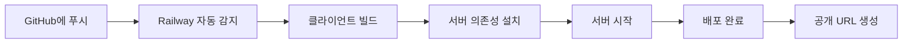

# Digital Wall 배포 가이드 (Railway)

이 문서는 Digital Wall 애플리케이션을 Railway에 배포하는 방법을 설명합니다.

## 목차
- [사전 준비](#사전-준비)
- [Railway 배포](#railway-배포)
- [환경 변수 설정](#환경-변수-설정)
- [로컬 테스트](#로컬-테스트)
- [트러블슈팅](#트러블슈팅)

---

## 사전 준비

### 필수 요구사항
- **Node.js** v16 이상
- **npm** (Node.js와 함께 설치됨)
- **Railway 계정** ([railway.app](https://railway.app)에서 가입)
- **GitHub 계정** (Railway 연동용)

### 프로젝트 확인
프로젝트 루트 디렉토리에 다음 파일들이 있는지 확인하세요:
- `railway.json` - Railway 배포 설정
- `.gitignore` - Git 제외 파일 목록
- `server/package.json` - 서버 의존성 및 엔진 설정
- `client/package.json` - 클라이언트 의존성

---

## Railway 배포

### 1. GitHub 저장소 생성

먼저 프로젝트를 GitHub에 올립니다:

```bash
# Git 초기화 (아직 안 했다면)
git init

# 파일 추가
git add .

# 커밋
git commit -m "Initial commit for Digital Wall"

# GitHub 저장소 연결 (자신의 저장소 URL로 변경)
git remote add origin https://github.com/YOUR_USERNAME/digital-wall.git

# 푸시
git push -u origin main
```

> **참고**: PowerShell 실행 정책 문제가 발생하면:
> ```powershell
> Set-ExecutionPolicy -ExecutionPolicy RemoteSigned -Scope CurrentUser
> ```

### 2. Railway 프로젝트 생성

1. [Railway 대시보드](https://railway.app/dashboard)에 접속
2. **New Project** 클릭
3. **Deploy from GitHub repo** 선택
4. 권한 승인 후 저장소 선택 (digital-wall)

### 3. 서비스 설정

Railway가 자동으로 `railway.json` 설정을 읽어 빌드합니다:
- **빌드 명령**: 클라이언트와 서버 모두 npm install 및 빌드 실행
- **시작 명령**: 서버 시작 (`cd server && npm start`)

### 4. 환경 변수 설정

Railway 대시보드에서:
1. 프로젝트 선택 → **Variables** 탭 클릭
2. 다음 환경 변수 추가:

| 변수 이름 | 값 | 설명 |
|----------|-----|------|
| `PORT` | `3000` | 서버 포트 (Railway는 자동으로 할당하므로 생략 가능) |
| `ADMIN_SECRET` | `your-secure-admin-password` | 관리자 비밀키 (반드시 변경!) |
| `NODE_ENV` | `production` | 프로덕션 환경 |

> [!CAUTION]
> `ADMIN_SECRET`은 반드시 강력한 비밀번호로 변경하세요! 이 값은 관리자 기능 접근에 사용됩니다.

### 5. 볼륨 설정 (데이터 영속성)

SQLite 데이터베이스 파일을 보존하려면 볼륨을 마운트합니다:

1. **Settings** 탭 → **Volumes** 섹션
2. **Add Volume** 클릭
3. 마운트 경로: `/app/server`
4. 저장

이렇게 하면 서버 재시작 시에도 `digital_wall.db` 파일이 유지됩니다.

### 6. 배포 확인

1. **Deployments** 탭에서 빌드 진행 상황 확인
2. **View Logs** 클릭하여 로그 확인
3. 성공하면 다음 메시지가 표시됩니다:
   ```
   데이터베이스에 연결되었습니다.
   데이터베이스 테이블이 준비되었습니다.
   서버가 http://localhost:3000 에서 실행 중입니다.
   ```
4. **Settings** → **Domains**에서 공개 URL 확인
   - 예: `https://digital-wall-production.up.railway.app`

---

## 환경 변수 설정

### server/.env 파일 (로컬 개발용)

Railway에서는 환경 변수를 대시보드에서 설정하지만, 로컬 개발을 위해 `.env` 파일을 생성할 수 있습니다:

```bash
# server/.env.example을 복사
cd server
cp .env.example .env
```

`.env` 파일 내용:
```env
PORT=3000
ADMIN_SECRET=local-dev-secret
NODE_ENV=development
```

> **주의**: `.env` 파일은 `.gitignore`에 포함되어 GitHub에 업로드되지 않습니다.

---

## 로컬 테스트

배포 전 로컬에서 프로덕션 빌드를 테스트할 수 있습니다.

### 1. 클라이언트 빌드

```bash
cd client
npm install
npm run build
```

빌드가 완료되면 `client/dist` 폴더에 프로덕션 파일이 생성됩니다.

### 2. 서버 실행

```bash
cd ../server
npm install
npm start
```

### 3. 브라우저 테스트

브라우저에서 `http://localhost:3000`에 접속하여:
- ✅ 페이지가 로드되는지 확인
- ✅ 포스트잇 생성/삭제 동작 확인
- ✅ 실시간 동기화 확인 (다른 탭에서 테스트)
- ✅ 개발자 도구 Console/Network 탭에서 에러 확인

---

## 트러블슈팅

### 문제: 빌드 실패 - "npm: 스크립트 실행 불가"

**원인**: Windows PowerShell 실행 정책 문제

**해결**:
```powershell
Set-ExecutionPolicy -ExecutionPolicy RemoteSigned -Scope CurrentUser
```

### 문제: Railway 빌드 시간 초과

**원인**: `npm install`이 너무 오래 걸림

**해결**:
1. Railway 대시보드 → **Settings** → **Build Configuration**
2. Build timeout을 늘림 (기본 10분 → 15분)

### 문제: 데이터베이스 파일이 재시작 시 초기화됨

**원인**: 볼륨이 마운트되지 않음

**해결**:
1. Railway 대시보드 → **Settings** → **Volumes**
2. `/app/server` 경로에 볼륨 추가
3. 서비스 재시작

### 문제: Socket.io 연결 실패

**원인**: CORS 설정 또는 WebSocket 지원 문제

**해결**:
1. `server/server.js`의 CORS 설정 확인:
   ```javascript
   const io = new Server(server, {
       cors: {
           origin: "*",  // 또는 특정 도메인
           methods: ["GET", "POST"]
       }
   });
   ```
2. Railway는 WebSocket을 자동 지원하므로 별도 설정 불필요

### 문제: 페이지가 404 에러

**원인**: 클라이언트 빌드 파일이 없음

**해결**:
1. `railway.json`의 빌드 명령 확인
2. Railway 로그에서 `npm run build` 성공 확인
3. `client/dist` 폴더가 생성되었는지 확인

### 문제: 관리자 기능 접근 불가

**원인**: `ADMIN_SECRET` 환경 변수가 설정되지 않음

**해결**:
1. Railway 대시보드 → **Variables**
2. `ADMIN_SECRET` 변수 추가
3. 서비스 재시작

---

## 추가 최적화

### 1. 커스텀 도메인 설정

Railway에서 무료로 커스텀 도메인을 연결할 수 있습니다:
1. **Settings** → **Domains** → **Custom Domain**
2. 도메인 입력 및 DNS 설정 (CNAME)

### 2. 모니터링 설정

Railway 대시보드에서 실시간 메트릭 확인:
- CPU/메모리 사용량
- 네트워크 트래픽
- 로그 스트리밍

### 3. 자동 배포 설정

GitHub에 푸시할 때마다 자동 배포되도록 설정:
- Railway 프로젝트 → **Settings** → **Deployments**
- **Auto Deploy** 활성화 (기본값)

---

## 요약



**배포 완료!** 🎉

이제 Railway에서 제공하는 URL로 Digital Wall에 접속할 수 있습니다!

---

## 참고 자료

- [Railway 공식 문서](https://docs.railway.app/)
- [Vite 배포 가이드](https://vitejs.dev/guide/static-deploy.html)
- [Express.js 프로덕션 Best Practices](https://expressjs.com/en/advanced/best-practice-performance.html)
